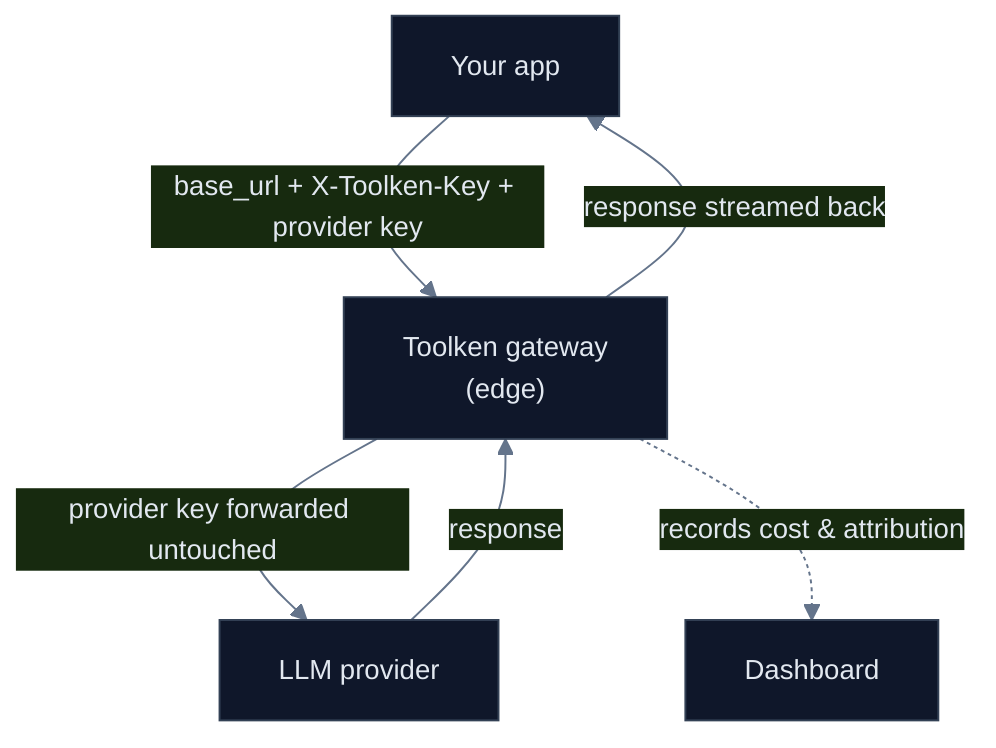

Toolken sits between your app and your LLM provider. One base-URL change is all it takes. Every request is forwarded with your own provider key, and its cost, attribution, and latency are recorded along the way.

<Frame caption="Cost, latency, reliability and token usage. Filter and break down by model, provider, or your own metadata.">
  <video autoPlay loop muted playsInline className="w-full aspect-video rounded-xl" src="/images/analytics-walkthrough.mp4" />
</Frame>

## The request path

<Note>Toolken adds a single edge hop. Recording happens off the response path, so it does not slow your call.</Note>

## Roll your own vs Toolken

| | Roll your own | Toolken |
| --- | --- | --- |
| Per-agent cost | Parse usage from every response, join to a pricing table, store it | One `X-Toolken-Meta-Agent` header |
| New model pricing | Track every provider price change yourself | Priced at the gateway, kept current |
| Stop a runaway agent | Build budget tracking and a kill-switch | Cap enforced at the edge, before the provider bills you |
| Latency added | None (you are inline) | One edge hop, off the response path |

## What you can do today

<CardGroup cols={2}>
  <Card title="Observability" icon="chart-bar" href="/features/observability/overview">Slice any metric by agent, feature, or customer.</Card>
  <Card title="Set budgets & limits" icon="shield-check" href="/features/budgets-rate-limits/budgets">Caps enforced at the edge.</Card>
  <Card title="Route any provider" icon="shuffle" href="/features/providers-routing/overview">One endpoint, your keys.</Card>
  <Card title="See it in the dashboard" icon="gauge" href="/features/observability/dashboard">Cost, usage, reliability, performance.</Card>
</CardGroup>

## Coming soon

<CardGroup cols={3}>
  <Card title="Response cache" icon="bolt">Cut cost and latency on repeated calls.</Card>
  <Card title="Fallbacks & routing" icon="arrows-rotate">Automatic retry across providers.</Card>
  <Card title="Vault & scoped keys" icon="key">Issue keys with attribution and limits built in.</Card>
</CardGroup>

## Next

<Card title="Quickstart" icon="rocket" href="/get-started/quickstart">Make your first attributed request in under two minutes.</Card>
